# Architecture

```mermaid
flowchart TB
    classDef config fill:#1a1a2e,stroke:#e94560,stroke-width:2px
    classDef data fill:#16213e,stroke:#0f3460,stroke-width:2px
    classDef tokenizer fill:#1a1a2e,stroke:#533483,stroke-width:2px
    classDef model fill:#16213e,stroke:#e94560,stroke-width:2px
    classDef optim fill:#1a1a2e,stroke:#0f3460,stroke-width:2px
    classDef training fill:#16213e,stroke:#533483,stroke-width:2px
    classDef exp fill:#1a1a2e,stroke:#e94560,stroke-width:2px
    classDef output fill:#16213e,stroke:#0f3460,stroke-width:2px
    classDef ckpt fill:#1a1a2e,stroke:#533483,stroke-width:2px
    classDef eval fill:#16213e,stroke:#e94560,stroke-width:2px
    classDef sweep fill:#1a1a2e,stroke:#0f3460,stroke-width:2px

    subgraph Config["Config System"]
        direction TB
        YAML(("config.yaml")) --> LOAD("load_config()")
        BASE("base config") -->|recursive inheritance| LOAD
        LOAD -->|deep merge| CFG("merged config dict")
    end

    subgraph DataPipeline["Data Pipeline"]
        direction TB
        RAW(("raw parquet / jsonl")) --> BUILD("build_dataset()")
        BUILD -->|download, dedup, filter, split| SPLITS("train / val / test split files")
        SPLITS -->|load_texts| TEXTS("text list")
        TEXTS --> PD("PackedDataset\ntokenize + chunk")
        PD --> DL("DataLoader")
        DL -->|batches| TRAIN
    end

    subgraph Tokenizer["Tokenizer Layer"]
        direction TB
        REG_TOK("TOKENIZER_REGISTRY") --> CT("create_tokenizer()")
        CT --> BPE("BPE")
        CT --> BB("Byte BPE")
        CT --> UNI("Unigram")
        CT --> CHAR("Character")
        BPE -->|train| ENC("encode / decode")
        BB --> ENC
        UNI --> ENC
        CHAR --> ENC
        ENC -->|tokenize| PD
        ENC -->|encode prompt| GEN
    end

    subgraph ModelArch["Model Architecture"]
        direction TB
        MC(("ModelConfig"))
        MC --> GPT("GPT")
        GPT -->|embed + positional| BLOCKS("N x TransformerBlock")
        BLOCKS --> RMS("RMSNorm + CausalSelfAttention")
        BLOCKS --> RMS2("RMSNorm + SwiGLU MLP")
        RMS -->|residual| BLOCKS
        RMS2 -->|residual| BLOCKS
        BLOCKS --> FN("RMSNorm + lm_head")
        FN --> LOGITS("logits")
        LOGITS -->|if targets| CEL("CrossEntropyLoss")
        LOGITS -->|generate| GEN("generate()\ntop-k sampling")
        GEN --> TEXT("output string")
    end

    subgraph Optimizer["Optimizer System"]
        direction TB
        REG_OPT("OPTIMIZER_REGISTRY") --> BO("build_optimizer()")
        BO -->|decay / no_decay param groups| OPT
        OPTW("AdamW") & OPTM("Muon\nNewton-Schulz") & OPTS("Sophia\nHessian-EMA") & OPTL("Lion\nsign-based") --> BO
    end

    subgraph Training["Training Loop"]
        direction TB
        TRAIN("Trainer.__init__()") -->|build optimizer| BO
        TRAIN -->|build scheduler| SCHED("LambdaLR\nwarmup + cosine decay")
        TRAIN -->|try_resume| CHK
        TRAIN -->|torch.compile| GPT
        TRAIN -->|metrics_tracker| MT
        TRAIN --> TRAINLOOP("train()")
        TRAINLOOP -->|forward| GPT
        TRAINLOOP -->|loss.backward| BWD("backward pass")
        BWD -->|grad_clip + optimizer.step| OPT
        OPT -->|scheduler.step| SCHED
        SCHED -->|next batch| TRAINLOOP
        TRAINLOOP -->|log_interval| MT
        TRAINLOOP -->|log_interval| DASH("render_dashboard()")
        DASH -->|ANSI clear + progress| CONSOLE("Terminal")
        TRAINLOOP -->|eval_interval| COMP("compute_metrics()")
        COMP -->|val_loss, perplexity| MT
        COMP -->|early_stop_patience| STOP{"val_loss improved?"}
        STOP -->|no| PAT("patience--")
        PAT -->|zero| DONE("break")
        TRAINLOOP -->|checkpoint_time| CHK
    end

    subgraph Experiment["Experiment Manager"]
        direction TB
        EM("ExperimentManager") -->|creates| RUNDIR("run directory")
        EM -->|creates| MT("MetricsTracker")
        MT -->|record per-step| RECS("step, loss, val_loss,\nperplexity, lr, grad_norm,\ntok/s, RAM, elapsed")
        MT -->|time_to_targets| TTT("first step + wall time\nfor each threshold")
        EM -->|save config| CFGY("config.yaml")
        EM -->|save metadata| HW("hardware.json")
        EM -->|save metadata| GIT("git.json")
        EM -->|save metadata| ENV("environment.json")
        EM -->|save_dataset_info| DSJ("dataset.json")
        EM -->|save_evaluation| EVJ("evaluation.json")
        EM -->|finalize| CSV("metrics.csv")
        EM -->|finalize| MJ("metrics.json")
        EM -->|finalize| SUMJ("summary.json")
    end

    subgraph Outputs["Outputs"]
        direction TB
        PLT("generate_all_plots()") --> P1("loss_curve.png")
        PLT --> P2("validation_loss.png")
        PLT --> P3("learning_rate.png")
        PLT --> P4("gradient_norm.png")
        PLT --> P5("ram_usage.png")
        PLT --> P6("tokens_per_second.png")
        REP("generate_experiment_report()") --> RPT("report.md")
    end

    subgraph Checkpoints["Checkpoint System"]
        direction TB
        CHK("save_checkpoint()") --> CKPTS
        CKPTS("checkpoints/\nbest_loss / best_val\nfastest / latest / final")
        CKPTS -->|restore_rng| LOAD("load_checkpoint()")
        LOAD -->|model + optimizer| TRY("try_resume()")
        TRY -->|latest or best_val| TRAIN
    end

    subgraph Evaluation["Evaluation Suite"]
        direction TB
        EVAL("run_full_evaluation()") --> PPL("compute_perplexity()\nval_loader to val_loss, PPL")
        EVAL --> EBM("evaluate_model()")
        EBM --> BENCH("BENCHMARKS")
        BENCH --> CC("code_completion\n5 prompts")
        BENCH --> PS("python_syntax\n5 prompts")
        BENCH --> MTH("math\n4 prompts")
        BENCH --> REA("reasoning\n2 prompts")
        BENCH --> TRI("trivia\n3 prompts")
        EBM -->|generate per prompt| RES("results per benchmark")
        EVAL -->|save_dir| EVJ
    end

    subgraph Sweep["Hyperparameter Sweep"]
        direction TB
        SY("sweep.yaml\nwith search section") --> GS("run_grid_search()")
        GS -->|expand + product| COMBOS("N config combinations")
        GS -->|run_fn per trial| TRAIN
        GS --> LB("leaderboard.csv\nsorted by best_loss")
    end

    subgraph Export["Inference / Export"]
        direction TB
        INF("generate()\ninference/generate.py") -->|encode| GEN
        INF -->|decode| OUT("output text")
        INF --> SAMP("sample_top_k / sample_top_p")
    end

    CFG -->|config dict| EM
    CFG --> TRAIN
    CFG --> GS
    CFG --> EVAL
    CFG --> PLT
    CFG --> REP

    class YAML,CFG,BASE config
    class RAW,BUILD,SPLITS,TEXTS,PD,DL data
    class REG_TOK,CT,BPE,BB,UNI,CHAR,ENC tokenizer
    class MC,GPT,BLOCKS,RMS,RMS2,FN,LOGITS,CEL,GEN,TEXT model
    class REG_OPT,BO,OPTW,OPTM,OPTS,OPTL optim
    class TRAIN,SCHED,TRAINLOOP,BWD,OPT,COMP,STOP,PAT,DONE,DASH,CONSOLE training
    class EM,RUNDIR,MT,RECS,TTT,CFGY,HW,GIT,ENV,DSJ,EVJ,CSV,MJ,SUMJ exp
    class PLT,P1,P2,P3,P4,P5,P6,REP,RPT output
    class CHK,CKPTS,LOAD,TRY ckpt
    class EVAL,PPL,EBM,BENCH,CC,PS,MTH,REA,TRI,RES eval
    class SY,GS,COMBOS,LB sweep
```

## Overview

DeepZero is a decoder-only transformer (GPT-style) organized into modular subsystems:

| Subsystem | Module | Role |
|-----------|--------|------|
| **Config** | `deepzero/config/loader.py` | YAML with `base:` inheritance, deep-merge |
| **Data** | `deepzero/datasets/` | Download, dedup, filter, split, PackedDataset chunking |
| **Tokenizer** | `deepzero/tokenizers/` | BPE / Byte BPE / Unigram / Character via registry |
| **Model** | `deepzero/models/transformer.py` | RMSNorm, SwiGLU, causal attention, weight tying |
| **Optimizer** | `deepzero/training/optimizer.py` | AdamW / Muon / Sophia / Lion via registry |
| **Training** | `deepzero/training/trainer.py` | Forward/backward, grad clip, scheduler, early stopping |
| **Metrics** | `deepzero/metrics/tracker.py` | Per-step records, time-to-target thresholds |
| **Dashboard** | `deepzero/training/dashboard.py` | Live ANSI terminal UI |
| **Experiment** | `deepzero/experiments/manager.py` | Run directory, metadata, finalization |
| **Checkpoints** | `deepzero/models/checkpoints.py` | 5 auto-selected checkpoints, RNG save/restore, resume |
| **Visualization** | `deepzero/visualization/plots.py` | 6 PNG plots (matplotlib, Agg backend) |
| **Reports** | `deepzero/reports/generator.py` | Markdown report with hardware, stats, TTT |
| **Evaluation** | `deepzero/evaluation/suite.py` | Perplexity + 5-category generation benchmarks |
| **Sweep** | `deepzero/sweeps/grid.py` | Cartesian grid search over `search:` config |
| **Inference** | `deepzero/inference/generate.py` | Top-k / top-p sampling, standalone generation |

## Key Design Decisions

- **Weight tying**: `token_embed.weight = lm_head.weight` — shares the embedding matrix between input and output projection, reducing parameters and improving token representation consistency.
- **Gradient accumulation**: Effective batch size = `batch_size × gradient_accumulation`. Accumulates gradients over N micro-batches before stepping the optimizer, enabling larger effective batches on limited hardware.
- **Linear warmup + cosine decay**: LR rises linearly to the target over `warmup_iters` steps, then decays following a cosine curve to near-zero over the remaining steps.
- **Param groups**: Optimizer splits parameters into `decay` (weight matrices: dim≥2) and `no_decay` (biases, norms: dim<2) groups. Weight decay is applied only to the decay group.
- **Time-to-target**: Pre-defined loss thresholds (4.0, 3.5, 3.0, 2.5, 2.0) — each records the step and wall clock when loss first crosses below that value. Useful for comparing optimizer convergence speed.
- **Auto checkpoint selection**: 5 named checkpoints — `best_loss.pt` (lowest training loss), `best_val.pt` (lowest validation loss), `fastest.pt` (highest throughput), `latest.pt` (most recent, default for resume), `final.pt` (end of training).
- **Config inheritance**: `base:` key in YAML recursively loads and deep-merges parent configs. Overrides win for scalar values; nested dicts merge recursively. Enables reusable base configs with focused overrides.
