# Module Dependencies

```mermaid
flowchart BT
    classDef leaf fill:#1a1a2e,stroke:#533483,stroke-width:2px
    classDef core fill:#16213e,stroke:#0f3460,stroke-width:2px
    classDef mid fill:#1a1a2e,stroke:#e94560,stroke-width:2px
    classDef high fill:#16213e,stroke:#533483,stroke-width:2px
    classDef script fill:#1a1a2e,stroke:#0f3460,stroke-width:2px,stroke-dasharray: 4 2

    subgraph Leaves["No deepzero imports (leaf modules)"]
        LAYERS["models/layers.py\nRMSNorm, CausalSelfAttention\nMLP (SwiGLU), TransformerBlock"]:::leaf
        TOK_BASE["tokenizers/base.py\nBaseTokenizer, create_tokenizer\nTOKENIZER_REGISTRY"]:::leaf
        METRICS["metrics/tracker.py\nMetricsTracker"]:::leaf
        CONFIG["config/loader.py\nload_config, _deep_merge"]:::leaf
        OPT["training/optimizer.py\nbuild_optimizer\nOPTIMIZER_REGISTRY\nMuon, Sophia, Lion"]:::leaf
        DASH["training/dashboard.py\nrender_dashboard"]:::leaf
        LOGGING["logging/setup.py\nsetup_logging"]:::leaf
        DS_BASE["datasets/base.py\nBaseDataset, create_dataset\nDATASET_REGISTRY"]:::leaf
        DS_LOADER["datasets/loader.py\nPackedDataset, TextDataset"]:::leaf
    end

    subgraph Tokenizers["Tokenizer implementations"]
        BPE["tokenizers/bpe.py\nBPETokenizer"]:::core
        BYTE_BPE["tokenizers/byte_bpe.py\nByteLevelBPETokenizer"]:::core
        UNIGRAM["tokenizers/unigram.py\nUnigramTokenizer"]:::core
        CHAR["tokenizers/character.py\nCharacterTokenizer"]:::core
    end

    subgraph Models["Model layer"]
        TRANSFORMER["models/transformer.py\nGPT, ModelConfig"]:::core
        CKPT["models/checkpoints.py\nsave_checkpoint, load_checkpoint\ntry_resume, CHECKPOINT_NAMES"]:::core
    end

    subgraph Training["Training subsystem"]
        TRAINER["training/trainer.py\nTrainer"]:::mid
        T_METRICS["training/metrics.py\ncompute_metrics"]:::core
    end

    subgraph Eval["Evaluation"]
        EVAL["evaluation/suite.py\nevaluate_model\ncompute_perplexity\nrun_full_evaluation\nBENCHMARKS"]:::mid
    end

    subgraph Exp["Experiment & Outputs"]
        EXP_MGR["experiments/manager.py\nExperimentManager"]:::mid
        PLOTS["visualization/plots.py\ngenerate_all_plots"]:::mid
        REPORTS["reports/generator.py\ngenerate_experiment_report"]:::mid
    end

    subgraph Bench["Benchmarks"]
        BENCH_OPT["benchmarks/optimizer.py\nrun_optimizer_benchmark"]:::mid
        BENCH_TOK["benchmarks/tokenizer.py\nrun_tokenizer_benchmark"]:::mid
    end

    subgraph Sweep["Sweep"]
        GRID["sweeps/grid.py\nrun_grid_search"]:::high
    end

    subgraph Inference["Inference"]
        INFER["inference/generate.py\ngenerate (free fn)"]:::mid
        INFER_SAMP["inference/sampling.py\nsample_top_k, sample_top_p"]:::core
    end

    subgraph Scripts["Scripts (entry points)"]
        S_TRAIN["scripts/train.py"]:::script
        S_PIPELINE["scripts/train_pipeline.py"]:::script
        S_SWEEP["scripts/sweep.py"]:::script
        S_BENCH_OPT["scripts/benchmark_optimizers.py"]:::script
        S_BENCH_TOK["scripts/benchmark_tokenizers.py"]:::script
        S_GENERATE["scripts/generate.py"]:::script
        S_REPL["scripts/repl.py"]:::script
        S_EXPORT["scripts/export.py"]:::script
        S_RUN["scripts/run.py"]:::script
    end

    TOK_BASE --> BPE
    TOK_BASE --> BYTE_BPE
    TOK_BASE --> UNIGRAM
    TOK_BASE --> CHAR

    LAYERS --> TRANSFORMER
    TRANSFORMER --> CKPT

    CKPT --> TRAINER
    TRANSFORMER --> TRAINER
    T_METRICS --> TRAINER
    OPT --> TRAINER
    DASH --> TRAINER
    DS_LOADER --- TRAINER

    TRANSFORMER --> EVAL

    METRICS --> EXP_MGR
    LOGGING --> EXP_MGR
    METRICS --> PLOTS
    METRICS --> REPORTS

    TRANSFORMER --> BENCH_OPT
    TOK_BASE --> BENCH_OPT
    TRAINER --> BENCH_OPT
    OPT --> BENCH_OPT
    EXP_MGR --> BENCH_OPT
    METRICS --> BENCH_OPT

    TOK_BASE --> BENCH_TOK

    CONFIG --> GRID

    TRANSFORMER --> INFER
    INFER_SAMP --> INFER

    TRAINER --> S_TRAIN
    EXP_MGR --> S_PIPELINE
    PLOTS --> S_PIPELINE
    REPORTS --> S_PIPELINE
    EVAL --> S_PIPELINE
    CONFIG --> S_PIPELINE
    TRAINER --> S_PIPELINE

    GRID --> S_SWEEP
    CONFIG --> S_SWEEP
    EXP_MGR --> S_SWEEP
    PLOTS --> S_SWEEP
    REPORTS --> S_SWEEP
    TRAINER --> S_SWEEP

    BENCH_OPT --> S_BENCH_OPT
    TOK_BASE --> S_BENCH_TOK
    BENCH_TOK --> S_BENCH_TOK

    CKPT --> S_GENERATE
    CKPT --> S_REPL
    CKPT --> S_EXPORT
    TRANSFORMER --> S_RUN
    TRAINER --> S_RUN
```

## Dependency Legend

| Layer | Description | Examples |
|-------|-------------|---------|
| **Leaves** | No `deepzero` imports — pure stdlib/third-party | `metrics/tracker.py`, `config/loader.py`, `training/optimizer.py` |
| **Core** | Depends only on leaves | `models/transformer.py`, `tokenizers/bpe.py` |
| **Mid** | Depends on core modules | `training/trainer.py`, `experiments/manager.py`, `benchmarks/optimizer.py` |
| **High** | Depends on mid modules | `sweeps/grid.py` |
| **Scripts** | Entry points, no reverse deps | `scripts/train.py`, `scripts/sweep.py` |

## Fan-in Analysis

| Module | Imported by | Role |
|--------|-------------|------|
| `models/transformer.py` (GPT) | 18 files | Central model — everything consumes it |
| `tokenizers/base.py` (create_tokenizer) | 10+ files | Tokenizer factory — all training/eval paths |
| `metrics/tracker.py` (MetricsTracker) | 5 files | Shared data bus for experiment outputs |
| `models/checkpoints.py` | 7 files | Load path for inference, eval, resume |

No circular dependencies detected — the graph is strictly acyclic.
