# Optimizer Comparison

```mermaid
flowchart LR
    classDef title fill:none,stroke:none,font-size:18px,font-weight:bold
    classDef header fill:#1a1a2e,stroke:#e94560,stroke-width:2px,font-weight:bold
    classDef cell fill:#16213e,stroke:#0f3460,stroke-width:1px
    classDef highlight fill:#1a1a2e,stroke:#533483,stroke-width:2px
    classDef best fill:#0a2a1a,stroke:#00ff88,stroke-width:2px,font-weight:bold
    classDef worst fill:#2a0a0a,stroke:#ff4444,stroke-width:2px

    AdamW_TITLE["AdamW"]:::title
    AdamW_METHOD["<b>Update Method</b><br/>decoupled weight decay<br/>+ adaptive LR per param<br/>(first/second moment EMA)"]:::cell
    AdamW_STRENGTH["<b>Strengths</b><br/>• Reliable, well-understood<br/>• Stable convergence<br/>• Default for most LLMs<br/>• No tuning needed"]:::cell
    AdamW_WEAK["<b>Weaknesses</b><br/>• Slowest throughput (491 tok/s)<br/>• Highest RAM (5.5 GB)<br/>• 2 momentum buffers per param"]:::cell
    AdamW_USE["<b>Best Use Case</b><br/>Production training<br/>when reliability > speed"]:::cell
    AdamW_BENCH["<b>Benchmark (15 steps)</b><br/>Final loss: 4.3122<br/>Tok/s: 491<br/>RAM: 5.5 GB<br/>Time: 510s"]:::cell

    Muon_TITLE["Muon"]:::title
    Muon_METHOD["<b>Update Method</b><br/>momentum + Newton-Schulz<br/>orthogonalization on<br/>2D weight matrices"]:::cell
    Muon_STRENGTH["<b>Strengths</b><br/>• Theoretically grounded<br/>• Orthogonal updates<br/>• Good for very wide nets"]:::cell
    Muon_WEAK["<b>Weaknesses</b><br/>• Worst convergence (5.5519)<br/>• NS iteration is expensive<br/>• LR very sensitive<br/>• High RAM (5.5 GB)"]:::cell
    Muon_USE["<b>Best Use Case</b><br/>Very wide architectures<br/>where orthogonal weights<br/>matter"]:::cell
    Muon_BENCH["<b>Benchmark (15 steps)</b><br/>Final loss: 5.5519<br/>Tok/s: 723<br/>RAM: 5.5 GB<br/>Time: 349s"]:::cell

    Sophia_TITLE["Sophia"]:::title
    Sophia_METHOD["<b>Update Method</b><br/>momentum / Hessian-diagonal<br/>with clipping<br/>(grad² EMA as Hessian)"]:::cell
    Sophia_STRENGTH["<b>Strengths</b><br/>• Best convergence (4.1593)<br/>• Good speed (728 tok/s)<br/>• Lowest RAM (4.9 GB)<br/>• Hessian-guided steps"]:::cell
    Sophia_WEAK["<b>Weaknesses</b><br/>• Extra h-buffer (grad² EMA)<br/>• Clipping hyperparam (ρ)<br/>• Less battle-tested"]:::cell
    Sophia_USE["<b>Best Use Case</b><br/>CPU training where every<br/>step matters — best<br/>loss-per-step efficiency"]:::cell
    Sophia_BENCH["<b>Benchmark (15 steps)</b><br/>Final loss: 4.1593 ← best<br/>Tok/s: 728<br/>RAM: 4.9 GB<br/>Time: 345s"]:::best

    Lion_TITLE["Lion"]:::title
    Lion_METHOD["<b>Update Method</b><br/>sign(momentum + gradient)<br/>evolutionary search-<br/>discovered algorithm"]:::cell
    Lion_STRENGTH["<b>Strengths</b><br/>• Fastest throughput (760 tok/s)<br/>• Lowest RAM (4.6 GB)<br/>• Single momentum buffer<br/>• Very simple update rule"]:::cell
    Lion_WEAK["<b>Weaknesses</b><br/>• Worse convergence (4.7626)<br/>• ER-MIKE trick breaks<br/>  sign symmetry<br/>• Less stable late training"]:::cell
    Lion_USE["<b>Best Use Case</b><br/>Rapid prototyping<br/>when speed > final loss"]:::cell
    Lion_BENCH["<b>Benchmark (15 steps)</b><br/>Final loss: 4.7626<br/>Tok/s: 760 ← fastest<br/>RAM: 4.6 GB<br/>Time: 333s"]:::best

    AdamW_TITLE --> AdamW_METHOD
    AdamW_METHOD --> AdamW_STRENGTH
    AdamW_STRENGTH --> AdamW_WEAK
    AdamW_WEAK --> AdamW_USE
    AdamW_USE --> AdamW_BENCH

    Muon_TITLE --> Muon_METHOD
    Muon_METHOD --> Muon_STRENGTH
    Muon_STRENGTH --> Muon_WEAK
    Muon_WEAK --> Muon_USE
    Muon_USE --> Muon_BENCH

    Sophia_TITLE --> Sophia_METHOD
    Sophia_METHOD --> Sophia_STRENGTH
    Sophia_STRENGTH --> Sophia_WEAK
    Sophia_WEAK --> Sophia_USE
    Sophia_USE --> Sophia_BENCH

    Lion_TITLE --> Lion_METHOD
    Lion_METHOD --> Lion_STRENGTH
    Lion_STRENGTH --> Lion_WEAK
    Lion_WEAK --> Lion_USE
    Lion_USE --> Lion_BENCH
```

## Summary

| Metric | AdamW | Muon | Sophia | Lion |
|--------|-------|------|--------|------|
| Final Loss (15 steps) | 4.3122 | 5.5519 | **4.1593** | 4.7626 |
| Throughput (tok/s) | 491 | 723 | 728 | **760** |
| Peak RAM (GB) | 5.5 | 5.5 | **4.9** | **4.6** |
| Training Time (s) | 510 | 349 | 345 | **333** |
| Buffers per param | 2 (m, v) | 1 (m) + NS iter | 2 (m, h) | 1 (m) |
| Hyperparameter sensitivity | Low | High | Medium | Medium |

## Verdict

- **Best convergence**: Sophia — Hessian diagonal guidance delivers ~3.5% lower loss than AdamW at comparable speed.
- **Best throughput**: Lion — 55% faster than AdamW, but converges ~10% worse.
- **Best all-rounder**: Sophia — best final loss, competitive speed, lowest RAM.
- **Default for reliability**: AdamW — slow but never surprises.
- **Needs tuning**: Muon — theoretically interesting but underperformed significantly at default LR.
