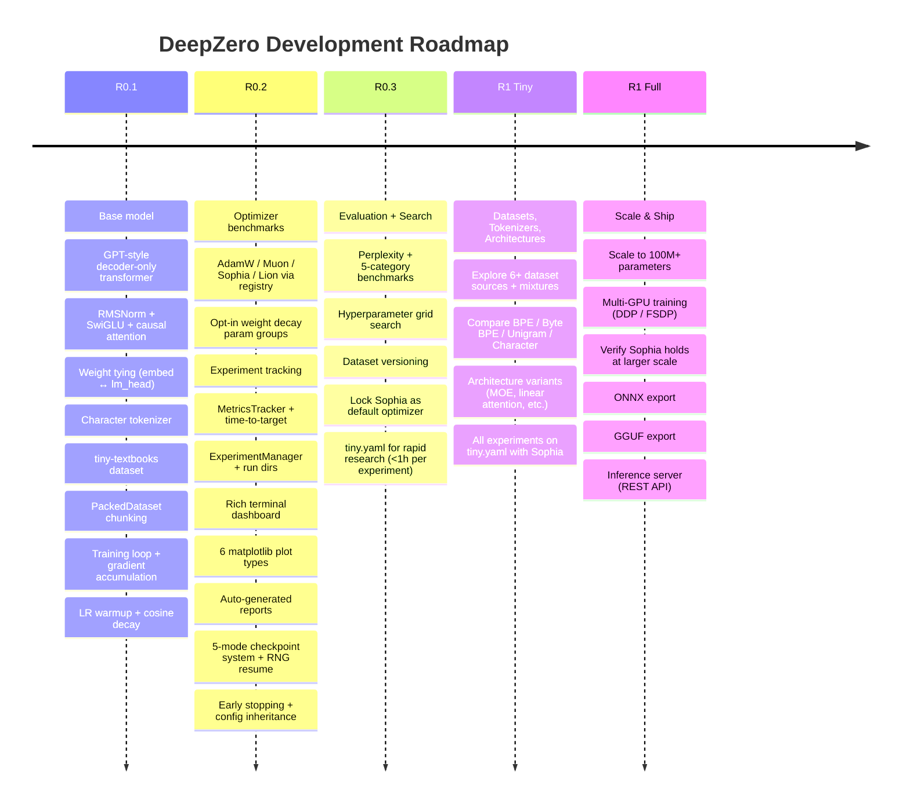

# Roadmap

## Release Plan

| Release | Focus | Model | Optimizer | Iteration Speed |
|---------|-------|-------|-----------|-----------------|
| **R0.x Tiny** | Lock infrastructure | 1.25M (tiny.yaml) | **Sophia** | ~1h per experiment |
| **R1 Tiny** | Dataset/tokenizer/architecture research | 1.25M (tiny.yaml) | Sophia | ~1h per experiment |
| **R1 Full** | Scale, deploy, verify | 100M+ | Sophia (verify at scale) | hours to days |

## Optimizer Decision

**Sophia is locked as the default** for all R0.x and R1 Tiny research. At R1 Full, we re-verify whether Sophia still wins at 100M+ parameters — optimizer performance can change with model scale.
