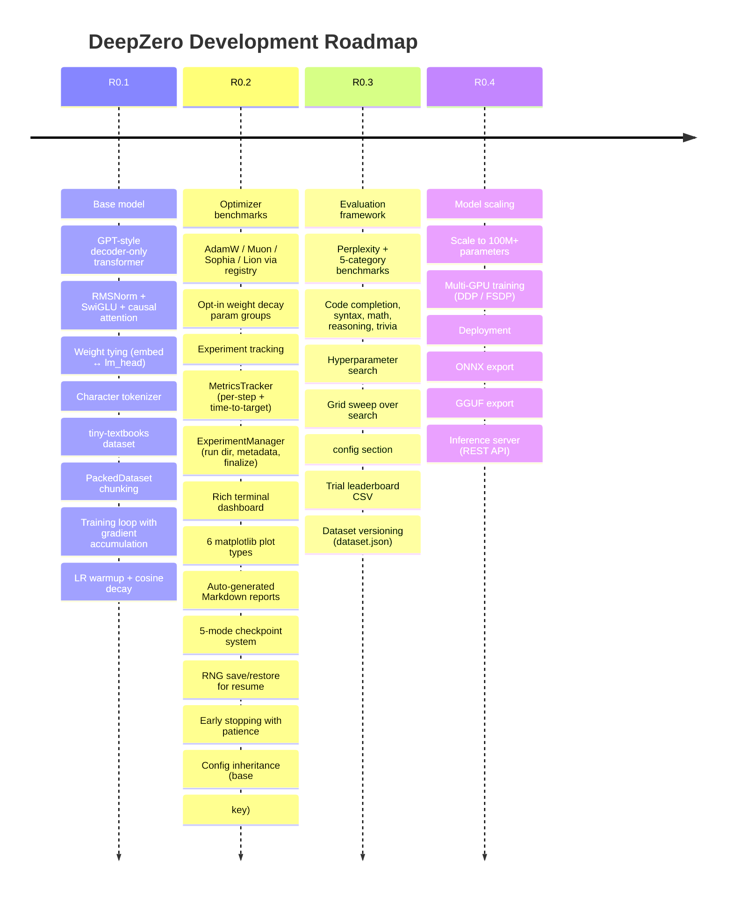

# Roadmap

## Release Plan

| Release | Focus | Key Deliverables |
|---------|-------|------------------|
| **R0.1** | Foundation | Transformer core, tokenizer, data pipeline, basic training |
| **R0.2** | Experimentation | Optimizer comparison, metrics tracking, visualization, reports, checkpoints |
| **R0.3** | Evaluation & Search | Model eval suite, hyperparameter grid search, dataset versioning |
| **R0.4** | Scale & Ship | Large model training, multi-GPU, ONNX/GGUF export, inference serving |
